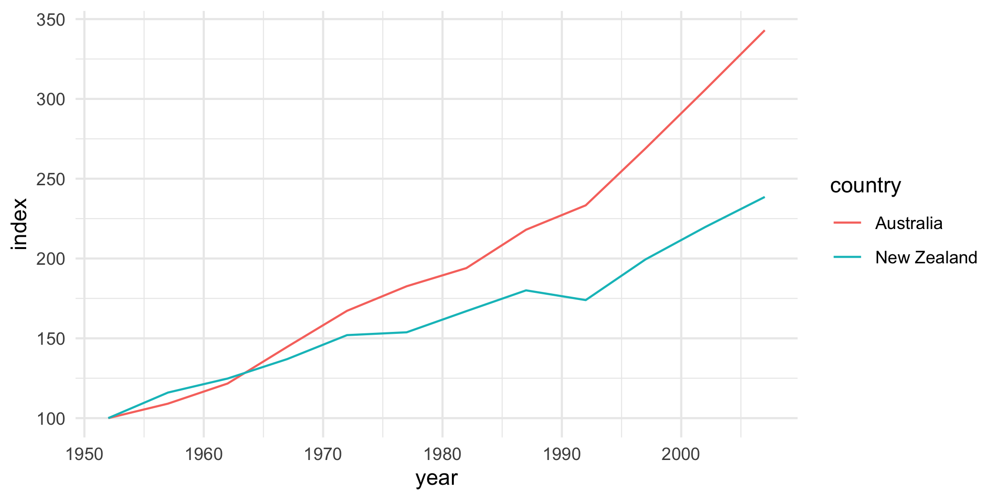

<!-- README.md is generated from README.Rmd. Please edit that file -->

# indexing

<!-- badges: start -->
<!-- badges: end -->

This package includes a function called `indexing()`. It allows you to
create an index from a variable, using specified observations as
reference points.

## Installation

You can install the development version of indexing from
[GitHub](https://github.com/stat545ubc-2023/indexing) with:

``` r
# install.packages("devtools")
devtools::install_github("stat545ubc-2023/indexing")
```

## Demonstrated usage

### Example 1:

In this example, the function creates a time series and sets an index
using the `values` column, with the base observation set at
`2023-01-01`.

``` r
# Toy dataset
set.seed(545)

df <- data.frame(date = seq(as.Date("2023-01-01"), 
                            as.Date("2025-12-01"),
                            "month"),
                 values = runif(12*3, 50, 150)*
                   (2 + cumsum(runif(12*3, 0, 0.15))))

# Index generation 

df2 <- df %>% 
  indexing(values,
           date == as.Date("2023-01-01"))

# Comparing original variable vs. indexed variable.

df2 %>% 
  ggplot(aes(x = date)) +
  geom_hline(yintercept = 100,
             linetype = "dashed") +
  geom_line(aes(y = values,
                color = "values")) +
  geom_line(aes(y = index,
                color = "index")) +
  theme_minimal()
```


### Example 2:

Using the toy dataset from earlier, this code chunk generates an indexed
variable taking the average values of multiple observations as
reference. Specifically, it computes the average for the year 2023. A
warning is issued in case this operation was not intended.

``` r
# Index generation 

df2 <- df %>% 
  indexing(values,
           year(date) == 2023)
#> Warning in indexing(., values, year(date) == 2023): More than one row is being
#> used as a reference.

# Comparing original variable vs. indexed variable.

df2 %>% 
  ggplot(aes(x = date)) +
  geom_hline(yintercept = 100,
             linetype = "dashed") +
  geom_line(aes(y = values,
                color = "values")) +
  geom_line(aes(y = index,
                color = "index")) +
  theme_minimal()
```


### Example 3:

In this section, we indexed the GDP per capita for Oceania countries
taking the year 1952 as the reference.

``` r
library(gapminder)

# Creating the country-wise index

idx_gap <- gapminder %>% 
  filter(continent == "Oceania") %>% 
  group_by(country) %>% 
  indexing(gdpPercap,
            year == 1952) 

# Comparison of indexes across countries

idx_gap %>% 
    ggplot(aes(x = year, 
             y = index,
             color = country)) +
  geom_line() +
  theme_minimal()
```


